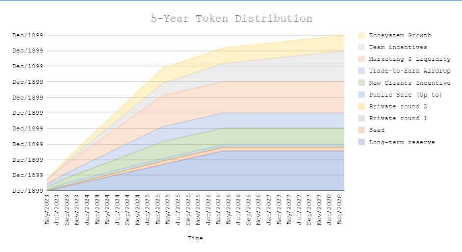
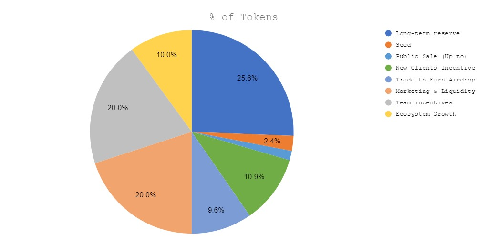

# Digitra Vesting

[What is Digitra.com’s DGTA token?](https://www.digitra.com/en/what-is-digitra-coms-dgta-token/)

  
  

Install project

```shell
git clone https://github.com/ZmicerVilenski/Degitra.git
npm i
```

1. Local tests

```shell
npx hardhat test
```

2. Before deploy in mainnet fill variables in .env file:
> VERIFY_ON_ETHERSCAN=true

3. Deploy & Verify with new deploy-script

```shell
npx hardhat run scripts/deploy.js --network sepolia
```

4. Change variable - VESTING_ADDRESS in .env file for new deployed Vesting contract address

5. Load vesting schedule data into smart contract

```shell
npx hardhat run --network sepolia ./scripts/fillVesting.js
```